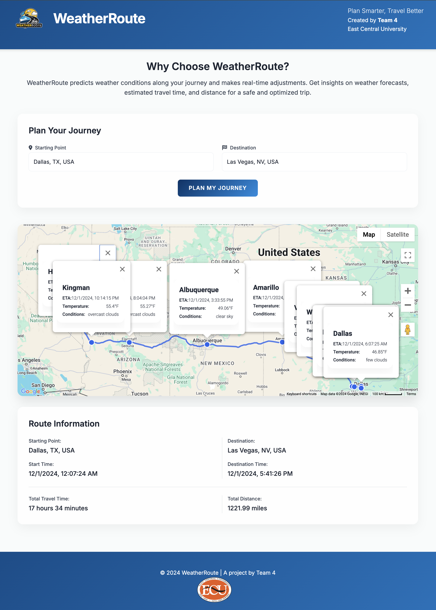

# WeatherRoute


  
WeatherRoute is a web-based application that predicts weather conditions along a travel route and offers real-time adjustments. Users input starting and ending points, and the application provides weather forecasts for each segment of their journey, along with the total estimated travel time and total distance.

## Features

- **Route Navigation**: Fetch cities along a route based on origin and destination.
- **City Filtering**: Filter cities by population.
- **Ordered Results**: Return cities in the order they appear along the route.
- **Weather Forecasting**: Predict weather conditions along the route.
- **Total Distance Calculation**: Calculate and display the total distance of the route in miles.
- **Total Travel Time Calculation**: Calculate and display the total travel time based on the estimated duration from Google Maps API.

**Primary Audience**: Travelers and commuters who need to plan trips based on dynamic weather conditions.

**Problem Solved**: WeatherRoute helps users navigate safely by providing accurate, location-based forecasts and rerouting options to avoid severe weather, improving travel safety and efficiency.

## Web Application

Shown below is what the UI looks like, with the response.



## Technical Architecture

The application is a web app using JavaScript for the frontend, Python for backend logic, and integrates with weather and routing APIs. A cloud-based database manages user preferences, historical data, and route recommendations.

### Backend Structure
```bash
src/
├── pages/                  # Contains Frontend Logid
│   └── map.html
│
├── api/                    # Contains Flask routes
│   ├── __init__.py
│   └── routes.py
│
├── services/               # Contains business logic for fetching routes and cities
│   ├── __init__.py
│   ├── route_service.py
│   ├── weather_service.py
│   └── city_service.py
│
├── utils/                  # Utility functions
│   ├── __init__.py
│   └── distance_calculator.py
│
├── config/                 # Configuration settings
│   ├── __init__.py
│   └── settings.py
│
└── main.py                 # Entry point to run the application
```

## Requirements

To run this project, you need to have Python 3.x installed. You also need to install the following dependencies:

- Flask
- googlemaps
- polyline
- requests

You can install the required packages using pip:

```bash
pip install -r requirements.txt
```

## Configuration
Before running the application, set your Google Maps API key in the config/settings.py file or as an environment variable:

```bash
GOOGLE_MAPS_API_KEY = 'YOUR_API_KEY'
```

## Running the Application
To start the API, run the following command:

```bash
python main.py
```

The application will be available at http://127.0.0.1:5000/create_route and takes in query parameters as input.

## Usage
To get cities along a route, make a GET request to the /create_route endpoint with origin and destination as query parameters:

### Example Request
```bash
curl -X POST http://127.0.0.1:5000/create_route \
-H "Content-Type: application/json" \
-d '{"origin": "Chicago,IL", "destination": "Houston,TX"}'
```

### Example Response
```bash
{
    "origin": "Chicago,IL",
    "destination": "Houston,TX",
    "estimatedDuration": 3600,
    "totalDistance": 800,
    "cities": [
        {
            "name": "City1",
            "state": "State1",
            "lat": 35.1234,
            "lon": -90.1234,
            "eta": "2023-11-09T12:00:00",
            "weather": {
                "temperature": 75,
                "description": "Clear"
            }
        },
        {
            "name": "City2",
            "state": "State2",
            ...
        }
    ],
    "polyline": "encoded_polyline_here"
}
```
